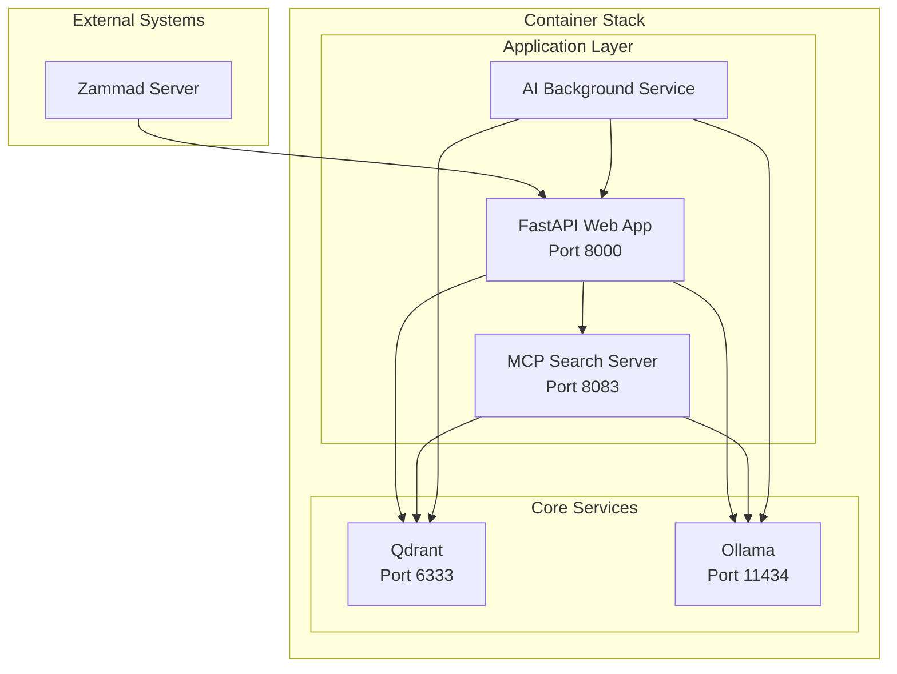

# 📖 Complete Docker Deployment Guide

**Comprehensive guide for deploying the Zammad Qdrant RAG system with Docker Compose.**

## 📋 Table of Contents

- [System Overview](#-system-overview)
- [Prerequisites](#-prerequisites)
- [Installation](#-installation)
- [Configuration](#-configuration)
- [Services](#-services)
- [Monitoring](#-monitoring)
- [Scaling](#-scaling)
- [Security](#-security)
- [Troubleshooting](#-troubleshooting)
- [Production](#-production)

## 🏗️ System Overview

### Architecture

The Zammad Qdrant RAG system consists of 5 interconnected services:



### Service Matrix

| Service | Image | Ports | Volumes | Dependencies |
|---------|-------|-------|---------|--------------|
| **qdrant/qdrant** | Official | 6333 | qdrant_data | None |
| **ollama/ollama** | Official | 11434 | ollama_data | None |
| **zammad-rag-app** | Custom | 8000 | ./logs, ./data | qdrant, ollama |
| **mcp-search** | Custom | 8083 | bm25_stats.json | qdrant |
| **zammad-ai** | Custom | - | ./logs | qdrant, ollama |

## 📋 Prerequisites

### System Requirements

#### Minimal Configuration
- **OS**: Linux (Ubuntu 20.04+), macOS, or Windows 10+
- **Docker**: 20.10+
- **Docker Compose**: 2.0+
- **RAM**: 4GB
- **Storage**: 20GB
- **CPU**: 2 cores

#### Recommended Configuration
- **RAM**: 8-16GB (for AI models)
- **Storage**: 50GB+ SSD
- **CPU**: 4+ cores
- **GPU**: NVIDIA GPU with CUDA (optional)
- **Network**: 100Mbps+ internet for model downloads

### Network Requirements

| Port | Service | Description |
|------|---------|-------------|
| 8000 | Web App | Main interface |
| 6333 | Qdrant | Vector database |
| 11434 | Ollama | AI models |
| 8083 | MCP Search | Search API |

### Zammad Requirements

1. **Zammad Version**: 3.0+
2. **API Access**: Valid API token
3. **Permissions**: 
   - `ticket.agent`
   - `ticket.customer`
   - `user.session`

## 📥 Installation

### Step 1: System Preparation

```bash
# Update system (Ubuntu/Debian)
sudo apt update && sudo apt upgrade -y

# Install Docker
curl -fsSL https://get.docker.com -o get-docker.sh
sudo sh get-docker.sh

# Add user to docker group
sudo usermod -aG docker $USER
newgrp docker

# Install Docker Compose
sudo curl -L "https://github.com/docker/compose/releases/download/v2.15.0/docker-compose-$(uname -s)-$(uname -m)" -o /usr/local/bin/docker-compose
sudo chmod +x /usr/local/bin/docker-compose

# Verify installation
docker --version
docker-compose --version
```

### Step 2: Repository Setup

```bash
# Clone repository
git clone https://github.com/your-username/zammad-qdrant-rag.git
cd zammad-qdrant-rag

# Verify file structure
ls -la | grep -E "(Dockerfile|docker-compose|.env)"
```

### Step 3: Environment Configuration

```bash
# Create environment file
cp .env.example .env

# Set proper permissions
chmod 600 .env
```

#### Environment Variables

| Variable | Description | Example |
|----------|-------------|---------|
| **ZAMMAD_URL** | Zammad server URL | `https://your-zammad.com/` |
| **ZAMMAD_TOKEN** | API token | `your_32_char_token` |
| **QDRANT_API_KEY** | Optional API key | `your_key_here` |
| **OLLAMA_MODEL** | Primary AI model | `qdrant` |
| **AI_ENABLED** | Enable AI service | `true` |
| **TOP_K** | Search results | `200` |
| **TOP_TICKETS** | Relevant tickets | `10` |

## ⚙️ Configuration

### Service Configuration

#### Qdrant (Vector Database)

```yaml
# docker-compose.yml
qdrant:
  image: qdrant/qdrant:latest
  container_name: qdrant
  ports:
    - "6333:6333"
  volumes:
    - qdrant_data:/qdrant/storage
  environment:
    - QDRANT__SERVICE__HTTP_PORT=6333
    - QDRANT__SERVICE__GRPC_PORT=6334
  healthcheck:
    test: ["CMD", "curl", "-f", "http://localhost:6333/health"]
    interval: 30s
    timeout: 10s
    retries: 3
    start_period: 40s
```

#### Ollama (AI Service)

```yaml
ollama:
  image: ollama/ollama:latest
  container_name: ollama
  ports:
    - "11434:11434"
  volumes:
    - ollama_data:/root/.ollama
  environment:
    - OLLAMA_HOST=0.0.0.0:11434
  healthcheck:
    test: ["CMD", "curl", "-f", "http://localhost:11434/api/tags"]
    interval: 30s
    timeout: 10s
    retries: 3
    start_period: 60s
```

#### FastAPI Application

```yaml
zammad-rag-app:
  build: .
  container_name: zammad-rag-app
  ports:
    - "8000:8000"
  depends_on:
    qdrant:
      condition: service_healthy
    ollama:
      condition: service_healthy
  environment:
    - ZAMMAD_URL=${ZAMMAD_URL}
    - ZAMMAD_TOKEN=${ZAMMAD_TOKEN}
    - QDRANT_URL=http://qdrant:6333
    - OLLAMA_URL=http://ollama:11434
  volumes:
    - ./logs:/app/logs
    - ./data:/app/data
  healthcheck:
    test: ["CMD", "curl", "-f", "http://localhost:8000/health"]
    interval: 30s
    timeout: 10s
    retries: 3
    start_period: 60s
```

### Security Configuration

#### Resource Limits

```yaml
# docker-compose.yml
deploy:
  resources:
    limits:
      memory: 6G
      cpus: '4'
    reservations:
      memory: 2G
      cpus: '1'
```

#### Network Security

```yaml
networks:
  zammad-rag:
    driver: bridge
    internal: false  # Allow internet access
    ipam:
      config:
        - subnet: 172.20.0.0/16
```

#### Volume Security

```yaml
volumes:
  qdrant_data:
    driver: local
    driver_opts:
      type: none
      o: bind
      device: ./qdrant_data
  ollama_data:
    driver: local
    driver_opts:
      type: none
      o: bind
      device: ./ollama_data
```

## 🔧 Services

### Health Monitoring

```bash
# Check all services
docker-compose ps

# Detailed health status
docker-compose ps --format "table {{.Name}}\t{{.Status}}\t{{.Ports}}"
```

### Individual Service Control

```bash
# Start specific service
docker-compose up -d qdrant

# Restart service
docker-compose restart zammad-rag-app

# View service logs
docker-compose logs -f mcp-search

# Execute command in container
docker-compose exec ollama ollama list
```

### Service Dependencies

```bash
# Start in dependency order
docker-compose up -d qdrant ollama
docker-compose up -d mcp-search
docker-compose up -d zammad-rag-app
docker-compose up -d zammad-ai
```

## 📊 Monitoring

### Health Checks

#### Automated Health Monitoring

```bash
#!/bin/bash
# health_monitor.sh

SERVICES=("zammad-rag-app" "qdrant" "ollama" "mcp-search")

for service in "${SERVICES[@]}"; do
    status=$(docker-compose ps -q $service | xargs docker inspect -f '{{.State.Health.Status}}' 2>/dev/null)
    echo "$service: $status"
    
    if [ "$status" != "healthy" ]; then
        echo "⚠️  $service is not healthy!"
        docker-compose logs $service --tail 20
    fi
done
```

#### Manual Health Checks

```bash
# Application health
curl -f http://localhost:8000/health

# Qdrant health
curl -f http://localhost:6333/health

# Ollama health
curl -f http://localhost:11434/api/tags

# MCP search health
curl -f http://localhost:8083/health
```

### Resource Monitoring

```bash
# Container resources
docker stats --no-stream

# Disk usage
docker system df -v
df -h

# Memory usage
free -h
```

### Log Management

```bash
# View logs with timestamps
docker-compose logs -t -f

# View specific service logs
docker-compose logs --tail 100 zammad-rag-app

# Export logs
docker-compose logs > system.log
```

## ⚡ Scaling

### Horizontal Scaling

```yaml
# docker-compose.scale.yml
version: '3.8'
services:
  zammad-rag-app:
    scale: 2
  mcp-search:
    scale: 2
```

```bash
# Scale services
docker-compose -f docker-compose.yml -f docker-compose.scale.yml up -d --scale zammad-rag-app=2
```

### Load Balancing

```yaml
# Traefik configuration
services:
  traefik:
    image: traefik:v2.9
    command:
      - "--api.insecure=true"
      - "--providers.docker=true"
      - "--entrypoints.web.address=:80"
      - "--entrypoints.websecure.address=:443"
    ports:
      - "80:80"
      - "443:443"
    volumes:
      - /var/run/docker.sock:/var/run/docker.sock:ro
```

### Database Scaling

```bash
# Qdrant cluster setup
# Primary
qdrant-primary:
  environment:
    - QDRANT__CLUSTER__ENABLED=true
    - QDRANT__CLUSTER__NODE_ID=0
    - QDRANT__CLUSTER__PEERS=192.168.1.10:6335,192.168.1.11:6335

# Secondary
qdrant-secondary:
  environment:
    - QDRANT__CLUSTER__ENABLED=true
    - QDRANT__CLUSTER__NODE_ID=1
    - QDRANT__CLUSTER__PEERS=192.168.1.10:6335,192.168.1.11:6335
```

## 🔐 Security

### Container Security

```yaml
# Security options
services:
  zammad-rag-app:
    security_opt:
      - no-new-privileges:true
    read_only: true
    tmpfs:
      - /tmp
    user: "1000:1000"
```

### Network Security

```yaml
# Firewall rules
networks:
  zammad-rag:
    driver: bridge
    internal: true
    attachable: true
```

### Environment Security

```bash
# Secure environment file
chmod 600 .env

# Use Docker secrets (production)
echo "ZAMMAD_TOKEN" | docker secret create zammad_token -
```

### SSL/TLS Configuration

```yaml
# Nginx reverse proxy
services:
  nginx:
    image: nginx:alpine
    ports:
      - "443:443"
      - "80:80"
    volumes:
      - ./ssl:/etc/ssl/certs
      - ./nginx.conf:/etc/nginx/nginx.conf
    depends_on:
      - zammad-rag-app
```

## 🚨 Troubleshooting

### Common Issues

#### Service Won't Start

```bash
# Check logs
docker-compose logs service-name

# Check port conflicts
sudo netstat -tlnp | grep :8000

# Check disk space
df -h

# Check memory
free -h
```

#### Qdrant Connection Issues

```bash
# Wait for startup
docker-compose logs qdrant | tail -20

# Check network
docker network inspect zammad-rag-zammad-rag

# Reset volumes
docker-compose down -v
docker-compose up -d
```

#### Ollama Model Issues

```bash
# Check available models
docker-compose exec ollama ollama list

# Download models
docker-compose exec ollama ollama pull qwen2.5

# Check model loading
docker-compose logs ollama | grep -i model
```

#### Memory Issues

```bash
# Increase Docker limits
# Edit /etc/docker/daemon.json
{
  "default-runtime": "runc",
  "default-ulimits": {
    "memlock": {
      "Hard": -1,
      "Name": "memlock",
      "Soft": -1
    }
  }
}

# Restart Docker
sudo systemctl restart docker
```

### Performance Issues

#### Slow Vector Search

```bash
# Check Qdrant performance
curl -X GET "http://localhost:6333/collections" | jq

# Monitor CPU usage
top -p $(pgrep -f zammad-rag-app)

# Check disk I/O
iotop
```

#### High Memory Usage

```bash
# Monitor memory per container
docker stats --no-stream --format "table {{.Container}}\t{{.CPUPerc}}\t{{.MemUsage}}"

# Reduce model size
export OLLAMA_MODEL="mistral:7b"  # Smaller than qwen2.5
```

## 🚀 Production

### Production Compose File

```yaml
# docker-compose.prod.yml
version: '3.8'

services:
  zammad-rag-app:
    deploy:
      replicas: 2
      restart_policy:
        condition: on-failure
        delay: 5s
        max_attempts: 3
        window: 120s
      resources:
        limits:
          memory: 4G
          cpus: '2'
        reservations:
          memory: 2G
          cpus: '1'
    environment:
      - ENVIRONMENT=production
      - LOG_LEVEL=info
    volumes:
      - ./production-logs:/app/logs:rw
      - ./production-data:/app/data:rw

  nginx:
    image: nginx:alpine
    ports:
      - "80:80"
      - "443:443"
    volumes:
      - ./nginx/nginx.conf:/etc/nginx/nginx.conf:ro
      - ./ssl:/etc/ssl/certs:ro
    depends_on:
      - zammad-rag-app
```

### Backup Strategy

```bash
#!/bin/bash
# backup.sh

BACKUP_DIR="./backups/$(date +%Y%m%d_%H%M%S)"
mkdir -p $BACKUP_DIR

# Backup Qdrant data
docker-compose exec qdrant tar -czf - /qdrant/storage > $BACKUP_DIR/qdrant_data.tar.gz

# Backup Ollama models
docker-compose exec ollama tar -czf - /root/.ollama > $BACKUP_DIR/ollama_data.tar.gz

# Backup application data
tar -czf $BACKUP_DIR/app_data.tar.gz ./data ./logs

echo "Backup completed: $BACKUP_DIR"
```

### Monitoring & Alerting

```yaml
# Prometheus monitoring
services:
  prometheus:
    image: prom/prometheus
    ports:
      - "9090:9090"
    volumes:
      - ./prometheus.yml:/etc/prometheus/prometheus.yml
      - prometheus_data:/prometheus

  grafana:
    image: grafana/grafana
    ports:
      - "3000:3000"
    environment:
      - GF_SECURITY_ADMIN_PASSWORD=admin
    volumes:
      - grafana_data:/var/lib/grafana
```

### Deployment Automation

```bash
#!/bin/bash
# deploy.sh

set -e

echo "Starting deployment..."

# Pull latest code
git pull origin main

# Build images
docker-compose build

# Backup current data
./backup.sh

# Deploy
docker-compose down
docker-compose up -d

# Health check
sleep 30
curl -f http://localhost:8000/health || {
    echo "Health check failed, rolling back..."
    git checkout HEAD~1
    docker-compose up -d
    exit 1
}

echo "Deployment successful!"
```

---

## 📞 Support

### Getting Help

- **Documentation**: This guide
- **Issues**: GitHub Issues
- **Community**: GitHub Discussions
- **API Docs**: http://localhost:8000/docs

### Useful Commands Reference

```bash
# Complete system management
docker-compose up -d                    # Start all services
docker-compose down                     # Stop all services
docker-compose restart                  # Restart all services
docker-compose logs -f                  # Follow all logs
docker-compose exec app bash            # Shell into app container
docker-compose up -d --scale app=2      # Scale application
docker system prune -af                 # Clean up unused resources
```

---

**🎯 This comprehensive guide covers all aspects of deploying the Zammad Qdrant RAG system in production environments.**