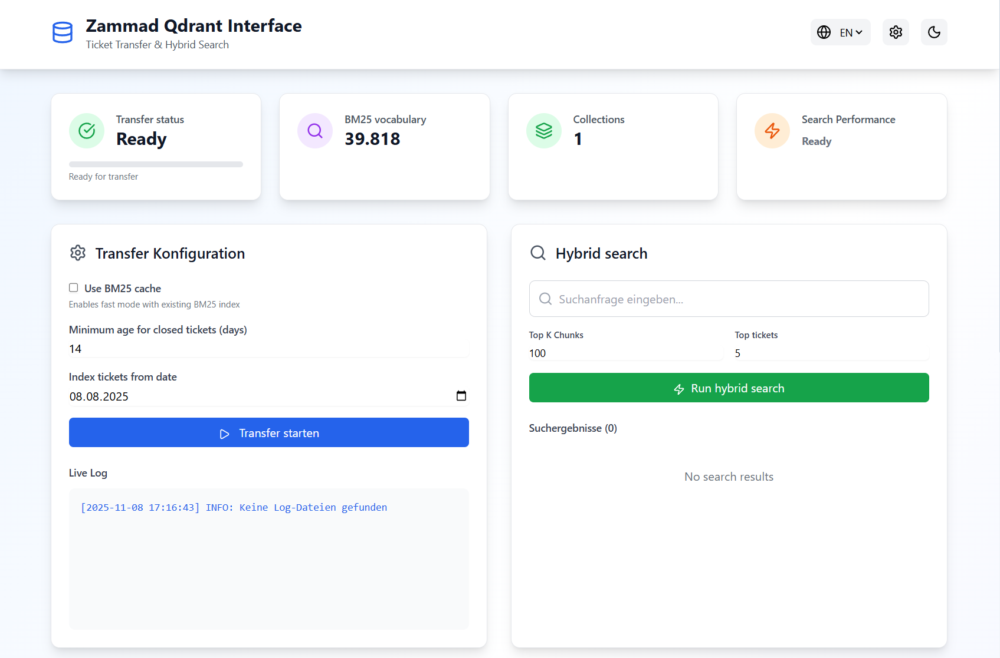
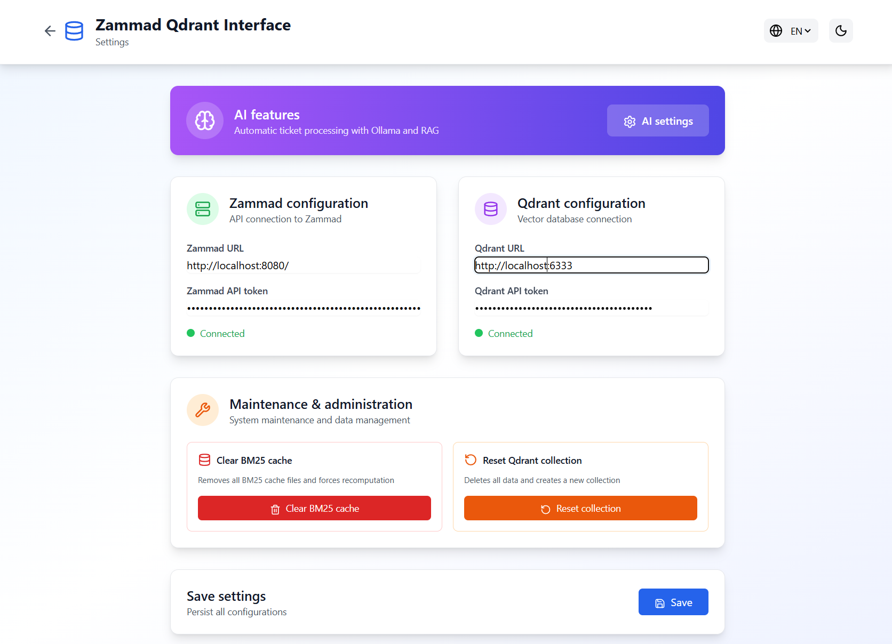
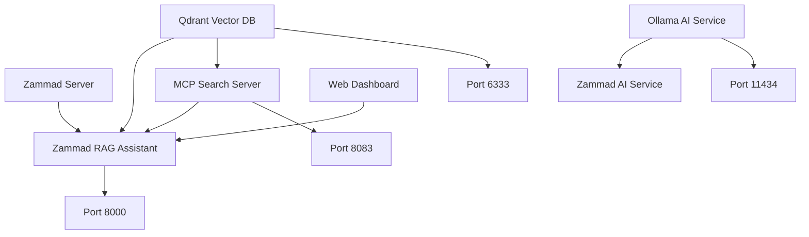

# 🚀 Zammad Qdrant RAG System

[](https://www.docker.com/)
[](https://python.org)
[](https://fastapi.tiangolo.com/)
[](https://qdrant.tech/)
[](https://ollama.ai/)

An intelligent RAG (Retrieval-Augmented Generation) system for Zammad tickets with AI-powered search, automated responses, and intelligent ticket processing.


## ✨ Main Features

### 🔍 Intelligent Ticket Search
- **Hybrid Search**: Combines Dense (Transformer) and Sparse (BM25) vector search
- **RAG Integration**: Contextual responses based on related tickets
- **Cross-Encoder Reranking**: Precise relevance scoring of search results

### 🤖 AI Automation
- **Automatic Ticket Response**: AI generates helpful notes for new tickets
- **Ollama Integration**: Local AI models for privacy and performance
- **Smart Prompts**: Optimized prompts for support scenarios

### 📊 Web Dashboard
- **Real-time Monitoring**: Live status of all services and processes
- **Transfer Management**: Manual and scheduled ticket transfers
- **AI Configuration**: Adjustable parameters for AI services
- **Multi-language**: Supports German and English

### 🏗️ Production-Ready Architecture
- **Docker Containers**: Complete containerization with Docker Compose
- **Health Checks**: Automatic monitoring of all services
- **Scalable**: Horizontal scaling for larger installations
- **Persistent Storage**: Database volumes for long-term data persistence

## 🎮 Live Demo

**🎯 1:1 Identical Interactive Demo** - Perfect for presentations and demos!

**View Demo**: [GitHub Pages Demo](https://dominikwoh.github.io/zammad-rag-assistant/demo/)

| Demo Page | Description | Link |
|-----------|-------------|------|
| 🏠 **Main Dashboard** | Live status, transfer simulation, hybrid search, schedules | [Demo Dashboard](https://dominikwoh.github.io/zammad-rag-assistant/demo/) |
| ⚙️ **System Settings** | Zammad API, Qdrant DB, maintenance controls | [Settings](https://dominikwoh.github.io/zammad-rag-assistant/demo/settings.html) |
| 🤖 **AI Configuration** | Ollama models, AI services, prompt editor | [AI Settings](https://dominikwoh.github.io/zammad-rag-assistant/demo/ai-settings.html) |

### ✨ Demo Features
- **Live Interactions**: Transfer buttons, search, schedules
- **Realistic Data**: BM25 statistics, search results, system status
- **Multi-language**: German/English toggle
- **Responsive**: Mobile-optimized for all devices
- **Fully Functional**: No backend integration required

> **Perfect for**: Presentations, demos, test UI, GitHub Pages hosting

### 📸 Demo Screenshots

**Main Dashboard Interface:**


**System Settings Page:**


## 📋 Table of Contents

- [Quick Start](#-quick-start)
- [Installation](#-installation)
- [Configuration](#-configuration)
- [Architecture](#️-architecture)
- [API Documentation](#-api-documentation)
- [Deployment](#-deployment)
- [Development](#-development)
- [Troubleshooting](#-troubleshooting)
- [Contributing](#-contributing)

## ⚡ Quick Start

### 🐳 Three Installation Options

#### Option 1: Docker Run (Quick Start)
**Direct start without cloning repository**

```bash
# Start Docker container directly
docker run -d \
  --name zammad-rag-assistant \
  -p 8000:8000 \
  -p 8083:8083 \
  duftertyp/zammad-rag-assistant:latest

# Open dashboard
open http://localhost:8000
```

#### Option 2: Docker Compose (Complete)
**Full installation with repository**

```bash
# Clone repository
git clone https://github.com/dominikwoh/zammad-rag-assistant.git
cd zammad-rag-assistant

# Configure environment
cp .env.example .env
# Edit .env with your Zammad and Qdrant credentials

# Start system with Docker Hub image
docker-compose up -d

# Open dashboard
open http://localhost:8000
```

#### Option 3: Local Installation (Development)
**For developers with local Python dependencies**

```bash
# Clone repository
git clone https://github.com/dominikwoh/zammad-rag-assistant.git
cd zammad-rag-assistant

# Create Python virtual environment
python -m venv venv
source venv/bin/activate  # Linux/Mac
# venv\Scripts\activate  # Windows

# Install dependencies
pip install -r requirements_container.txt

# Configure environment
cp .env.example .env
# Edit .env with your Zammad and Qdrant credentials

# Start app
python demo_app.py

# Open dashboard
open http://localhost:8000
```

### 📚 Documentation
- **[📖 Complete Docker Documentation](README-Docker-Deployment.md)** - Detailed setup guide
- **[🚀 Quick Start Guide](INSTALL-Docker.md)** - 5-minute setup
- **[🔧 API Documentation](http://localhost:8000/docs)** - Interactive API reference

## 📋 Prerequisites

| Component | Version | Description |
|-----------|---------|-------------|
| **Docker** | 20.10+ | Container platform |
| **Docker Compose** | 2.0+ | Multi-container orchestration |
| **RAM** | 4-8GB+ | Recommended for AI models |
| **Storage** | 10-20GB+ | For vector database |
| **Internet** | Required | For model downloads |

### 🔗 Repository Setup

```bash
# Clone repository
git clone https://github.com/dominikwoh/zammad-rag-assistant.git
cd zammad-rag-assistant

# Check all Docker files
ls -la | grep -E "(Dockerfile|docker-compose|.env)"
```

### 🌐 System Requirements

#### Minimal Configuration
- **CPU**: 2 cores
- **RAM**: 4GB
- **Storage**: 10GB

#### Recommended Configuration
- **CPU**: 4+ cores  
- **RAM**: 8-16GB
- **Storage**: 50GB+ SSD
- **GPU**: Optional for Ollama acceleration

## ⚙️ Configuration

### 🔑 Zammad API Setup

1. **Create new user** (recommended for security):
   - Zammad Admin → Users → Add User
   - Name: "Zammad RAG Assistant"
   - Email: zammad-rag@your-domain.com
   - Group: "RAG Bot" or "System"

2. **Generate API token for the new user**:
   - Login as the new RAG user
   - Profile → Tokens → API Token → Create
   - **Name**: "Zammad RAG API Token"
   - **Scopes**: `ticket.agent`, `ticket.customer`, `user.session`
   - Copy token and use in `.env`

### 🔗 Qdrant API Setup

1. **Generate Qdrant API Key**:
   - In Qdrant Dashboard → "API Keys" → "Create API Key"
   - **Name**: "Zammad RAG Assistant"
   - **Permissions**: "Read", "Write", "Optimize"
   - Copy API Key and use in `.env`
   - Optional: If Qdrant runs locally, API Key can be left empty

### 🏗️ Environment Configuration

```bash
# .env - Zammad Configuration
ZAMMAD_URL="https://your-zammad.example.com/"
ZAMMAD_TOKEN="zammad_api_token_here"

# Qdrant Configuration
QDRANT_URL="https://your-qdrant.example.com/"
QDRANT_API_KEY="qdrant_api_key_here"  # Optional, empty for local

# Search Configuration
TOP_K="200"        # Search results
TOP_TICKETS="10"   # Relevant tickets
```

### 🤖 Optional AI Configuration

```bash
# If you want to use Ollama locally:
# docker-compose exec ollama ollama pull qwen3:8b
# docker-compose exec ollama ollama pull llama2

# AI Services (optional)
OLLAMA_URL="http://ollama:11434"  # Only for local Ollama
OLLAMA_MODEL="qwen3:8b"  # Standard model
AI_ENABLED="true"
```

## 🏗️ Architecture

### System Overview



### Service Details

| Service | Port | Function | Volume |
|---------|------|----------|---------|
| **qdrant** | 6333 | Vector Database | `qdrant_data` |
| **ollama** | 11434 | AI Model Service | `ollama_data` |
| **zammad-rag-app** | 8000 | Web Interface | `./logs`, `./data` |
| **mcp-search** | 8083 | Search API | `bm25_stats.json` |
| **zammad-ai** | - | Background Processing | `./logs` |

## 📡 API Documentation

### Web Interface APIs
- **GET** `/api/config` - Current configuration
- **POST** `/api/config` - Save configuration
- **GET** `/api/transfer-status` - Transfer status
- **POST** `/api/transfer-start` - Start transfer
- **POST** `/api/transfer-stop` - Stop transfer

### AI APIs
- **GET** `/api/ai-config` - AI configuration
- **POST** `/api/ai-config` - Save AI configuration
- **POST** `/api/ai-test-connection` - Test Ollama connection
- **POST** `/api/ai-service-start` - Start AI service
- **POST** `/api/ai-service-stop` - Stop AI service

### Search APIs
- **GET** `/api/search` - Ticket search (proxy)
- **GET** `/api/mcp-status` - MCP server status
- **POST** `/api/mcp-start` - Start MCP server
- **POST** `/api/mcp-stop` - Stop MCP server

**Interactive Documentation**: `http://localhost:8000/docs`

## 🚀 Deployment

### Local Development

```bash
# Development setup
docker-compose -f docker-compose.yml -f docker-compose.dev.yml up -d

# With hot reload
docker-compose -f docker-compose.dev.yml up
```

### Production Deployment

```bash
# Production build
docker-compose -f docker-compose.prod.yml up -d

# With resource limits
docker-compose -f docker-compose.prod.yml --scale zammad-rag-app=2 up -d
```

### Cloud Deployment Options

#### AWS ECS/EKS
- CloudFormation templates available
- Auto-scaling configuration
- RDS/ElastiCache integration

#### Google Cloud Run
- Container-Optimized OS
- Cloud SQL integration
- Load Balancer setup

#### Azure Container Instances
- AKS integration
- Azure Database
- Monitor integration

## 💻 Development

### Local Setup

```bash
# Python environment
python -m venv venv
source venv/bin/activate  # Linux/Mac
# venv\Scripts\activate  # Windows

# Install dependencies
pip install -r requirements_container.txt

# Start services separately
docker-compose up qdrant ollama

# Local development
python demo_app.py
```

### Code Structure

```
zammad-qdrant-rag/
├── 📁 zammad-qdrant-rag/          # Main application
│   ├── 📄 demo_app.py             # FastAPI web interface
│   ├── 📄 zammad_ai.py            # AI service
│   ├── 📄 zammad_to_qdrant.py     # Transfer service
│   ├── 📄 rerank_search_mcp.py    # MCP search server
│   ├── 📁 templates/              # HTML templates
│   └── 📁 static/                 # CSS/JS assets
├── 📁 docker/                     # Docker configuration
├── 📄 docker-compose.yml          # Multi-service stack
├── 📄 Dockerfile                  # Python container
├── 📄 requirements_container.txt  # Python dependencies
└── 📄 .env.example               # Environment template
```

### Testing

```bash
# Unit tests
pytest tests/ -v

# Integration tests
pytest tests/integration/ -v

# API tests
pytest tests/api/ -v

# Coverage report
pytest --cov=zammad_rag tests/ --cov-report=html
```

## 🔧 Troubleshooting

### Common Issues

#### 🚫 Qdrant won't start
```bash
# Check volume permissions
sudo chown -R 1000:1000 ./qdrant_data

# Check port conflict
netstat -tlnp | grep 6333

# Analyze logs
docker-compose logs qdrant
```

#### 🤖 Ollama models loading slowly
- **Normal**: First start loads large models (several GB)
- **Monitor**: `docker-compose logs ollama`
- **Check models**: `docker-compose exec ollama ollama list`

#### 🌐 Web interface unreachable
```bash
# Service status
docker-compose ps

# Health checks
curl -f http://localhost:8000/health

# Container logs
docker-compose logs zammad-rag-app
```

#### 💾 Memory errors
```bash
# Check container resources
docker stats

# Adjust memory limits
# docker-compose.yml:
deploy:
  resources:
    limits:
      memory: 6G
```

### Debug Modes

```bash
# Individual services in debug mode
docker-compose up --no-deps zammad-rag-app

# Open container shell
docker-compose exec zammad-rag-app bash

# Python debugging
docker-compose exec zammad-rag-app python -m pdb demo_app.py
```

## 📈 Monitoring

### Health Checks

```bash
# All services
docker-compose ps

# Specific health checks
curl -f http://localhost:8000/health    # Web App
curl -f http://localhost:8083/health    # MCP Search
curl -f http://localhost:6333/health    # Qdrant
curl -f http://localhost:11434/api/tags # Ollama
```

### Performance Monitoring

```bash
# Container statistics
docker stats

# Disk usage
docker system df -v

# Service metrics
docker-compose exec zammad-rag-app python -c "
import psutil
print(f'CPU: {psutil.cpu_percent()}%')
print(f'Memory: {psutil.virtual_memory().percent}%')
"
```

## 🤝 Contributing

### Development Workflow

1. **Fork repository**
2. **Create feature branch**
   ```bash
   git checkout -b feature/your-feature-name
   ```
3. **Implement changes**
4. **Run tests**
   ```bash
   pytest tests/ -v
   ```
5. **Commit & push**
   ```bash
   git commit -m "feat: add amazing new feature"
   git push origin feature/your-feature-name
   ```
6. **Create pull request**

### Code Standards

- **Python**: PEP 8 + Black formatting
- **Tests**: 80%+ coverage required
- **Documentation**: All public APIs documented
- **Commits**: Conventional Commits style

### Contribution Areas

- 🐛 **Bug Fixes**: Issues labeled `bug`
- ✨ **Features**: Issues labeled `enhancement`
- 📚 **Documentation**: Issues labeled `documentation`
- 🧪 **Tests**: Issues labeled `testing`

### 🆘 Getting Help

- **📖 [Documentation](README-Docker-Deployment.md)** - Comprehensive guides
- **💬 [GitHub Discussions](https://github.com/dominikwoh/zammad-rag-assistant/discussions)** - Community support
- **🐛 [Bug Reports](https://github.com/dominikwoh/zammad-rag-assistant/issues)** - Issues and bug reports
- **📧 [Email Support](mailto:support@example.com)** - Direct support

### Community

- **Discord Server**: [Discord Community](https://discord.gg/your-discord)
- **Reddit**: r/ZammadRAG
- **Twitter**: [@ZammadRAG](https://twitter.com/ZammadRAG)

## 📄 License

This project is licensed under the **MIT License** - see [LICENSE](LICENSE) for details.

## 🙏 Acknowledgments

- **Qdrant Team** - For the excellent vector database
- **Ollama Team** - For local AI model services  
- **FastAPI Team** - For the modern web framework
- **Zammad Community** - For the support system
- **Open Source Community** - For countless libraries

## ⭐ Statistics


---

**Made with ❤️ for the Open Source Community**

*If you like this project, give it a ⭐ on GitHub!*
