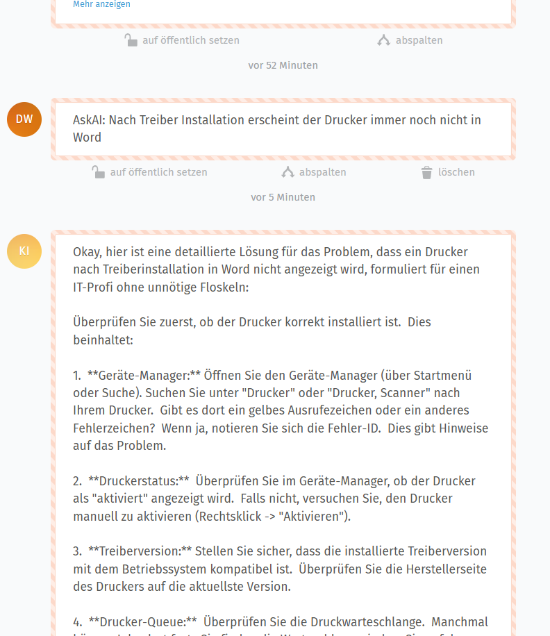
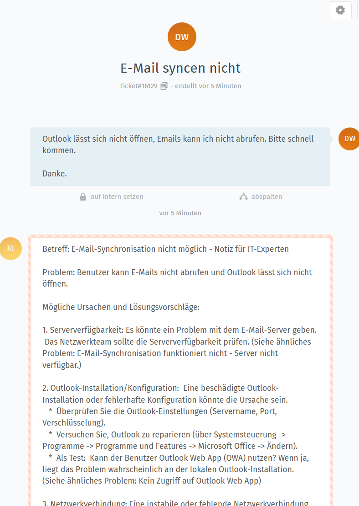

# Zammad RAG Assistant

Dieses Repository stellt einen KI-unterstützten IT-Support-Assistenten für Zammad bereit, der die Möglichkeiten von Vektor-Suche und großen Sprachmodellen (LLM) nutzt, um das Ticket-Handling zu automatisieren. Das System integriert sich mit Zammad für das Ticket-Management, Qdrant für die Vektor-Suche und Ollama für die LLM-Verarbeitung, um Lösungen oder Support-Antworten basierend auf früheren Tickets und Wissen vorzuschlagen.

## Features

- **Automatisierte Ticketverarbeitung**: Der Assistent verarbeitet automatisch neue und offene Zammad-Tickets.
- **Abfrage-Erweiterung**: Die Benutzereingabe wird durch ein LLM (über Ollama) erweitert, um mehrere Varianten einer Abfrage zu generieren und die Suchergebnisse zu verbessern.
- **Vektor-Suche mit Qdrant**: Verwendet eine vektorbasierte Suche, um relevantes Wissen und bereits gelöste Tickets zu finden, die bei neuen Tickets helfen.
- **LLM-gestützte Ticketbearbeitung**: Wenn keine ausreichenden Antworten gefunden werden, nutzt das System ein lokales LLM-Modell, um mögliche Lösungen vorzuschlagen.
- **Integration mit Zammad**: Integriert sich mit Zammad, um Tickets abzurufen, mit LLM-Antworten zu aktualisieren und Daten zu verarbeiten.

<p float="left">
  
  
</p>

## Installation

### Voraussetzungen

- Docker und Docker Compose
- Python 3
- Zammad-Instanz (optional, kann über Docker installiert werden)

### Installation

1. **Setup**:
```
apt install curl -y
curl -O https://raw.githubusercontent.com/DominikWoh/zammad-rag-assistant/main/setup.sh
chmod +x setup.sh
./setup.sh     # Ausführen
```

    Dieses Skript wird:
    - Notwendige Abhängigkeiten installieren (Docker, Python, etc.).
    - Zammad installieren (optional).
    - KI-Komponenten (Qdrant, Ollama, OpenWebUI) konfigurieren.
    - Notwendige Umgebungsdateien und Konfigurationen erstellen.
    - Python-Pakete und Abhängigkeiten installieren.
    - Einen Cron-Job für die automatische Ausführung des Skripts einrichten.
    - Den Zammad RAG Service aktivieren und starten.

3. **Zammad API konfigurieren**:
    Während der Installation wirst du aufgefordert, dein Zammad API-Token und die URL einzugeben. Wenn Zammad nicht installiert ist, fragt das Skript, ob es installiert und konfiguriert werden soll.

4. **Service starten**:
    Der Assistent wird die Zammad-Tickets automatisch verarbeiten. Der Service läuft als systemd-Dienst und verwendet einen Cron-Job, um Tickets regelmäßig zu verarbeiten.

## Dateien

- **`setup.sh`**: Das Haupt-Setup-Skript, das Abhängigkeiten installiert, Services konfiguriert und die Umgebung einrichtet.
- **`zammad_rag_poller.py`**: Das Skript, das kontinuierlich Zammad nach neuen Tickets abfragt und sie mit dem KI-Assistenten verarbeitet.
- **`ZammadToQdrant.py`**: Ein Skript, das Tickets in Qdrant für die Vektor-Suche und Indexierung einpflegt.

## Konfiguration

1. **Umgebungsvariablen**: Die `.env`-Datei enthält Konfigurationen für die Zammad-Instanz, API-Tokens und Modell-Einstellungen. Sie wird während des Setups automatisch erstellt.
2. **Modelle**: Das System verwendet ein benutzerdefiniertes LLM-Modell, das über Ollama gehostet wird, sowie ein vordefiniertes Vektor-Einbettungsmodell (`intfloat/multilingual-e5-base`) für die Vektor-Suche.

## Den Service ausführen

Das System läuft als Hintergrunddienst unter `systemd`. Um den Dienst manuell zu steuern:

```bash
# Dienst starten
sudo systemctl start zammad_rag_service.service

# Dienst so einrichten, dass er beim Booten startet
sudo systemctl enable zammad_rag_service.service

# Dienststatus anzeigen
sudo systemctl status zammad_rag_service.service
